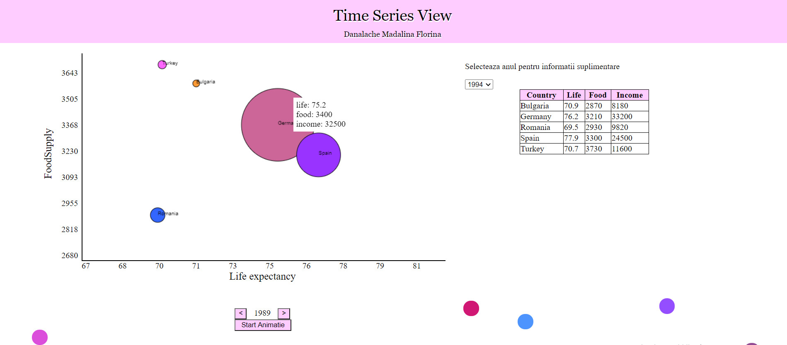

<h1 align="center">Data Visualization Project</h1>

<h3>Description</h3>

Graphic display of a time series using the canvas element.
The data within the application is stored in JSON format and data show the influence of the characteristics of food supply, income and life expectancy in 5 chosen countries, over a period of 30 years.

<h3>Characteristics:</h3>
<ol>
<li>Representation of data in the form of a bubble chart.</li>
<li>Creating an animation by successively representing the bubble charts generated each year.</li>
<li>Table display of data for a period chosen by the user.</li>
<li>Display the data in detailed format by simply clicking on the corresponding circle.</li>
<li>Creating a user-friendly design</li>
</ol>

<h3 align="center"><a href="https://danalachemadalina.github.io/data-visualization/data-visualization.html" >You can see a live version of this project here.</a></h3>